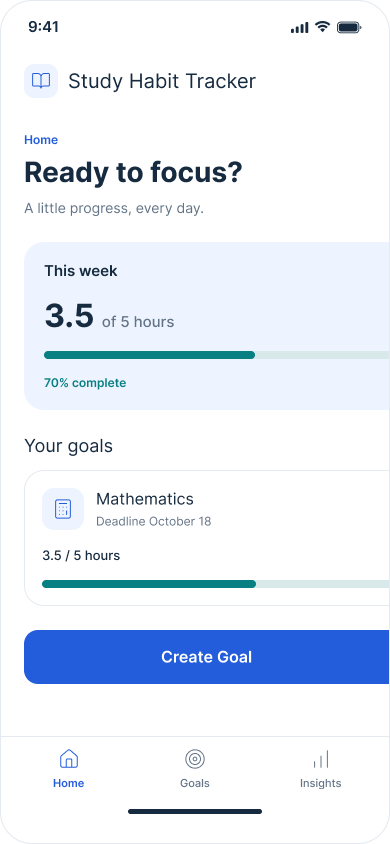
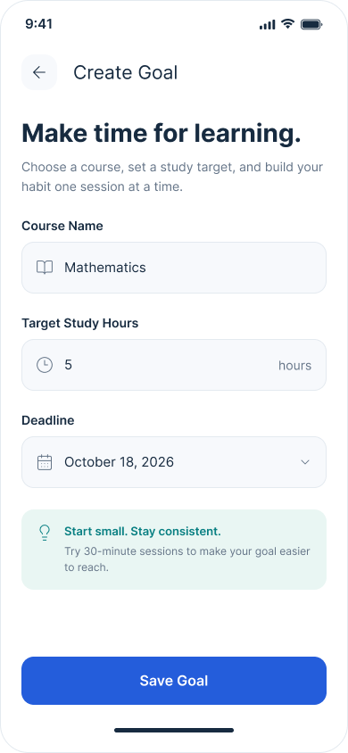
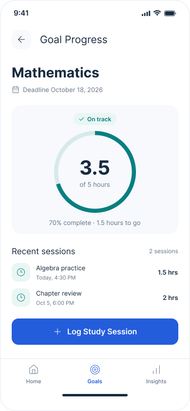

# Study Habit Tracker: Goal-Setting Prototype

**Name:** Kamani Mccalla

## Assigned Task

My assigned task is to design the goal-setting feature for the Study Habit Tracker.

## Purpose

The goal-setting feature allows students to create study goals for their courses. A student can choose a course, enter the number of hours they want to study, and select a deadline.

## User

The primary user is a student who wants to organize their study time and develop more consistent study habits.

## How the Prototype Works

1. The student opens the Study Habit Tracker.
2. The student selects **Create Goal**.
3. The student enters the course name.
4. The student enters the target number of study hours.
5. The student chooses a deadline.
6. The student saves the goal.
7. The application displays the new goal and its current progress.

## Prototype Screens

### Home

The Home screen gives the student an overview of the weekly study target and current goals. The student can select **Create Goal** to begin setting a new goal.

### Create Goal

The Create Goal screen allows the student to enter a course name, target study hours, and a deadline. The student selects **Save Goal** after entering the information.

### Goal Progress

The Goal Progress screen displays the student's completed hours, target hours, deadline, and current status. It also gives the student an option to log another study session.

## Figma Design

[Study Habit Tracker - Goal Setting Prototype](https://www.figma.com/design/6GuDQ39e8D7mGNCU9phyXe/Study-Habit-Tracker---Goal-Setting-Prototype)

